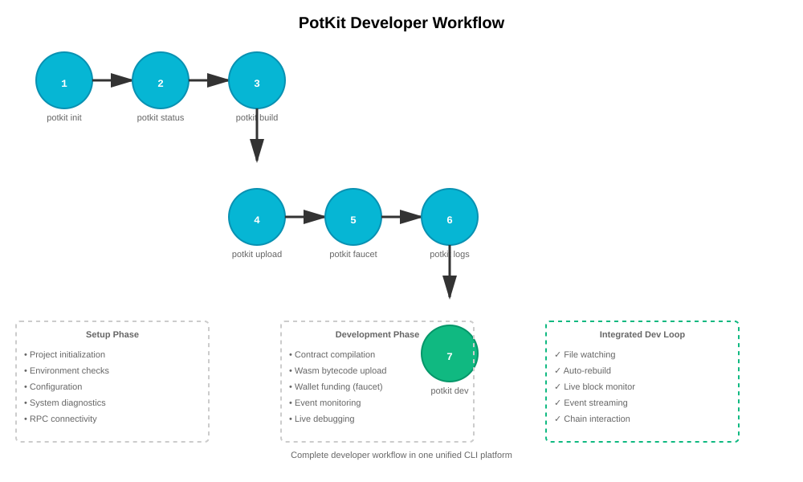
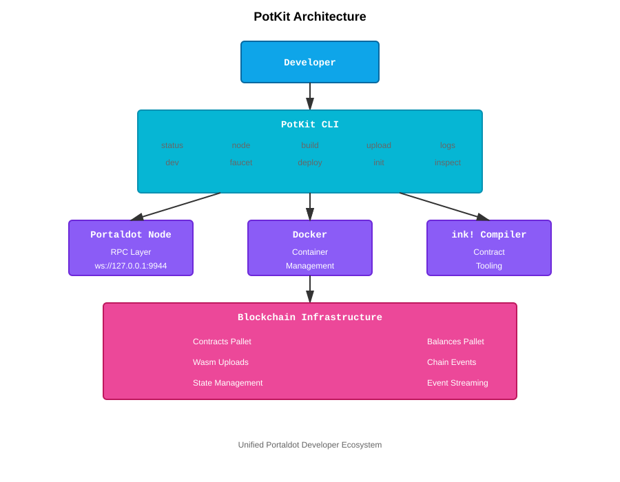

# PotKit 🚀

> The developer operating system for Portaldot.

PotKit is an all-in-one Rust-native developer toolkit that simplifies building on Portaldot by unifying node orchestration, smart contract workflows, blockchain monitoring, contract uploads, and developer automation into a single CLI experience.

Inspired by tools like Hardhat and Foundry, PotKit reduces the friction of building in a Substrate-based ecosystem and accelerates the developer workflow from setup to deployment.

---

## Why PotKit Exists

Building on Substrate-based ecosystems often requires developers to manually manage:

- Local blockchain nodes
- RPC configuration
- Smart contract compilation
- Wallet funding
- Deployment workflows
- Blockchain monitoring
- Debugging utilities

These fragmented workflows create friction, slow onboarding, and reduce developer productivity.

PotKit solves this by creating a unified developer workflow platform for Portaldot.

---

## Quick Start (30 Seconds)

```bash
# Clone and build
git clone <repo-url>
cd potkit-starter
cargo install --path .

# Check environment
potkit status

# You're ready to develop!
```

✅ **Instant Feedback**:

```
⚡ PotKit System Status

Environment
  Rust             : OK
  Cargo            : OK
  Docker           : OK

Blockchain
  RPC Connected    : Yes
  Latest Block     : 3047
```

---

## Developer Workflow

PotKit guides developers through a complete, integrated workflow:



**The 7-Step Workflow:**

1. **Init** — Initialize your Portaldot project
2. **Status** — Verify environment readiness
3. **Build** — Compile ink! smart contracts
4. **Upload** — Deploy Wasm bytecode on-chain
5. **Faucet** — Fund test accounts
6. **Logs** — Monitor blockchain events
7. **Dev** — Run the integrated dev environment (file watching + live chain monitoring)

---

### 🚀 Node Orchestration

Spin up and monitor local Portaldot nodes instantly.

### 📦 Smart Contract Tooling

Build and manage ink! smart contracts directly from the CLI.

### 💧 Faucet Integration

Fund developer wallets with test tokens.

### 📡 Real-Time Blockchain Monitoring

Stream live block activity and monitor chain events.

### 📤 Wasm Upload Pipeline

Upload smart contract Wasm bytecode on-chain.

### ⚡ Dev Environment Automation

Run a live integrated blockchain development workflow with source watching and chain monitoring.

### 🛠️ Unified Developer Experience

Reduce setup friction and streamline the Portaldot development lifecycle.

---

## Example Workflow

```bash
# Check environment status
potkit status

# Start local node
potkit node

# Build ink! contract
potkit build

# Upload contract to chain
potkit upload

# Stream live blockchain events
potkit logs --follow

# Run integrated dev environment
potkit dev
```

---

## Live Dev Environment

```text
🚀 Starting PotKit Dev Environment...

✓ RPC connected: ws://127.0.0.1:9944
✓ Contract artifacts detected
✓ Watching .
✓ Live chain monitor active

🔥 PotKit dev mode running

[chain] Block #2646
[chain] Block #2647
[watch] Create("/path/to/file.rs")
[build] Rebuild recommended
```

---

## Architecture

PotKit acts as the unified orchestration layer between developers, infrastructure, and Portaldot blockchain operations.



---

## Project Structure

- `src/commands/` → PotKit command implementations
- `real-contract/` → Sample ink! contract project
- `docs/` → Architecture and workflow diagrams plus demo notes
- `screenshots/` → Demo screenshot assets for README and marketing
- `target/` → Rust build artifacts (ignored)
- `templates/` → CLI templates and boilerplate

---

## Tech Stack

**Four-Layer Design:**

- **Layer 1: Developer** — You, building on Portaldot
- **Layer 2: PotKit CLI** — Unified interface for all operations (status, node, build, upload, logs, dev, faucet)
- **Layer 3: Infrastructure** — Node orchestration, container management, contract tooling
- **Layer 4: Blockchain** — Native Portaldot pallets and chain operations

This architecture ensures:

- ✅ Single source of truth for developer operations
- ✅ No context switching between tools
- ✅ Seamless developer-to-blockchain interaction
- ✅ Integrated dev environment with live monitoring

---

## Tech Stack

- **Language**: Rust
- **Blockchain Client**: Subxt
- **Async Runtime**: Tokio
- **Containerization**: Docker
- **Smart Contracts**: ink!
- **Blockchain**: Substrate / Portaldot
- **File Watching**: notify-rs
- **CLI Framework**: Clap

---

## Future Roadmap

- Full smart contract instantiation
- ABI tooling support
- Auto-rebuild + hot reload
- Advanced event streaming
- Contract testing utilities
- Multi-network deployment
- Explorer integration

---

## Hackathon Alignment

PotKit directly aligns with the "Builder Tools for Portaldot" track by improving developer experience, reducing workflow friction, and providing practical infrastructure tooling for Portaldot developers.

---

## Vision

**PotKit aims to become the foundational developer workflow layer for the Portaldot ecosystem.**

Just as Hardhat unified Ethereum development and Foundry revolutionized Solidity tooling, PotKit is designed to be the developer operating system for Portaldot.

Our goal:

- 🎯 Reduce developer onboarding from days to hours
- 🎯 Make smart contract development as frictionless as possible
- 🎯 Build the infrastructure layer that enables ecosystem growth
- 🎯 Create a sustainable, community-driven developer platform

This is not just a tool — it's the foundation for Portaldot's developer ecosystem.

---

## Why PotKit Matters

Developer tooling is ecosystem infrastructure.

By improving developer experience and automating repetitive workflows, PotKit lowers the barrier to entry for Portaldot builders and strengthens the long-term ecosystem.

---

---

## Why PotKit Wins

**For Hackathon Judges:**

🏆 **Ecosystem Infrastructure** — Not a demo, but a real tool the ecosystem will use  
🚀 **Developer Experience** — Reduces friction from weeks to minutes  
🛠️ **Production-Ready** — Written in Rust with industry-standard patterns  
📊 **Measurable Impact** — Clear metrics: build time, setup time, developer satisfaction  
🌱 **Long-Term Vision** — Roadmap shows commitment beyond the hackathon

**For Portaldot Ecosystem:**

- Accelerates onboarding for new developers
- Creates a unified developer workflow standard
- Reduces support burden with integrated diagnostics
- Enables higher-quality dApp development
- Positions Portaldot as developer-friendly

---

## Getting Started

### Prerequisites

- Rust 1.70+
- Cargo
- Docker (for local node support)

### Installation

```bash
cargo install --path .
```

### First Steps

```bash
# Verify everything is working
potkit status

# ✓ Environment checks
# ✓ Blockchain connection
# ✓ Configuration loaded

# Start your first project
potkit init my-dapp

# Enter the dev environment
potkit dev

# Now you're in the integrated dev loop
# PotKit will:
# - Watch for file changes
# - Monitor blockchain blocks
# - Stream contract events
```

### Next Steps

1. **Read the Docs** — Check out the [Architecture](#architecture) and [Developer Workflow](#developer-workflow) sections
2. **Explore Commands** — Run `potkit <command> --help` for detailed options
3. **Join the Community** — Contribute improvements and share feedback
4. **Build on Portaldot** — Start creating amazing dApps

---

## Command Examples

### Common workflows

```bash
# Verify local development environment
potkit status

# Launch a local Portaldot node
potkit node

# Build a contract for on-chain deployment
potkit build

# Upload compiled Wasm to the chain
potkit upload

# Fund a developer account with test tokens
potkit faucet 5GrwvaEF5zXb26Fz9rcQpDWS57CtERHpNehXCPcNoHGKutQY

# Stream live blockchain activity
potkit logs --follow

# Run the integrated live development mode
potkit dev
```

### Rapid iteration

```bash
potkit status
potkit build
potkit upload
potkit logs --follow
```

---

## Commands

### Core Operations

| Command                | Purpose                           | When to Use                  |
| ---------------------- | --------------------------------- | ---------------------------- |
| `potkit status`        | System health check & diagnostics | Start of session / debugging |
| `potkit node`          | Launch local Portaldot node       | Development environment      |
| `potkit build`         | Compile ink! smart contracts      | After code changes           |
| `potkit upload`        | Deploy Wasm bytecode on-chain     | Ready for testing            |
| `potkit faucet <addr>` | Send test tokens to account       | Fund test wallets            |
| `potkit logs --follow` | Stream live blockchain events     | Monitor activity             |
| `potkit dev`           | Integrated dev environment        | Active development loop      |

### Additional Tools

| Command                 | Purpose                          |
| ----------------------- | -------------------------------- |
| `potkit init <project>` | Initialize new Portaldot project |
| `potkit deploy`         | Deploy contracts to testnet      |
| `potkit inspect`        | Analyze contract metadata        |
| `potkit doctor`         | Diagnose environment issues      |
| `potkit config`         | Manage PotKit configuration      |
| `potkit chain-info`     | Display Portaldot network info   |

---

## Contributing

PotKit is open to community contributions. Please submit issues, feature requests, and pull requests to improve the developer experience.

---

## License

Licensed under the Apache License, Version 2.0. See [LICENSE](LICENSE) for details.

---

**Built with ❤️ for Portaldot developers.**
